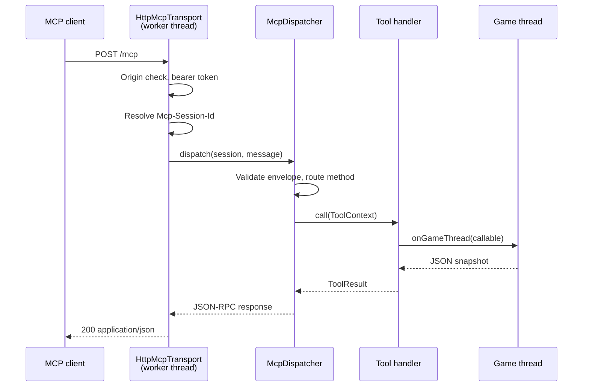

# Architecture

## Package map

```
com.micatechnologies.minecraft.mcmcp
├── Mcmcp                     @Mod entry; lifecycle, endpoint ownership
├── McmcpConstants            Identity, from the generated Tags class
├── McmcpConfig               Forge configuration; builds endpoint settings
├── McmcpProxy/Common/Client  The client/server split
├── command/                  /mcmcp
│
├── json/                     Gson helpers and the JSON Schema builder
├── protocol/                 JSON-RPC, MCP methods, sessions, dispatch   ← no Minecraft imports
├── mcp/                      Tool/resource/prompt model and registry
├── transport/                Streamable HTTP; endpoint composition
├── game/                     Game-thread bridges, side enum, paths
│
├── tools/                    Common + server tools, game-state serialisation
├── resources/                Common + server resources
├── prompts/                  Common prompts
└── client/                   CLIENT-ONLY — never named from common code
    ├── ClientThreadBridge
    ├── ClientInputScheduler
    ├── ClientInputLock
    ├── ClientChatRecorder
    └── tools/                Client tools, resources, prompts
```

Two boundaries in that layout are load-bearing.

**`protocol/` imports no Minecraft class.** That is what makes the wire format unit-testable without a
running game, and it is what would let a second transport — a Unix socket, an in-process pipe for
another mod — be added without touching the protocol. `McpDispatcher` takes a session and a parsed
`JsonObject` and returns a `JsonObject` or null. It knows nothing about HTTP, headers or sockets.

**`client/` is client-only, in full.** Everything in it references `Minecraft`. A dedicated server that
so much as class-loads one of these dies at startup with Forge's "Attempted to load class … for
invalid side SERVER". Nothing in common code may name these types; they are reached only through
`McmcpClientProxy`. The CI smoke test exists largely to catch a violation of this.

## Request lifecycle



Every step before `onGameThread` runs on an HTTP worker. Everything that touches world state runs on
the game thread. Nothing crosses that boundary except immutable JSON.

## The threading rule

This is the most important invariant in the mod.

Minecraft's world state — entities, chunks, inventories, the player, the GUI — is owned by one thread
per side and guarded by nothing at all. Touching it from an HTTP handler thread does not throw; it
corrupts. The failure surfaces minutes later as a `ConcurrentModificationException` in unrelated code,
a half-written chunk save, or a silently desynced client.

So:

1. Every tool that reads or writes game state goes through `ToolContext.onGameThread`.
2. The JSON is built **on the game thread** and the finished `JsonObject` is what crosses back.
3. No Minecraft object reference ever escapes the game thread. `GameJson` exists to enforce this by
   construction — it takes live objects and returns JSON, and its javadoc says outright that every
   method must be called on the game thread.

`GameThreadBridge` has two implementations. `ServerThreadBridge` resolves the `MinecraftServer`
through `FMLCommonHandler` on every call rather than caching one, because the integrated server is a
fresh instance for every world the player opens and a cached reference would schedule work onto a dead
server after the first world exit. `ClientThreadBridge` uses `Minecraft.addScheduledTask`.

Both short-circuit when already on the game thread. Scheduling onto the thread you are already on and
then waiting for it is an instant deadlock.

Both complete their future exceptionally rather than rethrowing. An exception escaping a scheduled
task propagates into the tick loop and crashes the game; a misbehaving MCP tool must not be able to do
that.

### Detecting client liveness

1.12.2 offers no public way to ask whether the client is running — `Minecraft.running` is
package-private and there is no accessor. `ClientThreadBridge` uses `getFramebuffer() != null`
instead: the framebuffer is created during `Minecraft.init()`, so non-null means graphics
initialisation completed. That is both a real liveness test and exactly the precondition the
screenshot tools need.

It cannot detect a client that has *begun shutting down*; nothing public can. The timeout in
`callOnGameThread` is the honest backstop — a task scheduled onto a stopped client simply never runs.

## Registry and side filtering

One `McpRegistry` holds every tool, resource and prompt. Each declares which sides it supports, and
each endpoint filters at list time and at call time.

Registering once rather than per endpoint means one place to add a tool and one place to forget.
Filtering the **listing** matters as much as filtering the call: tool discovery is how a model plans,
and a tool listed but permanently broken produces a plan that cannot work and a failure the model
cannot diagnose.

Names are unique registry-wide and collisions throw. Silently keeping the first or last registration
would make behaviour depend on mod load order — the kind of bug that only reproduces on someone else's
modpack.

Registration is open to other mods, and any registration fires a `list_changed` notification so live
sessions pick it up without reconnecting. See [Extending MCMCP](extending.md).

## Sessions

A session outlives any single HTTP exchange. The transport is a sequence of short POSTs plus,
optionally, one long-lived GET carrying an SSE stream; the client is identified across all of them by
`Mcp-Session-Id`.

Everything that must persist between exchanges lives in `McpSession`: negotiated protocol version,
client capabilities, resource subscriptions, log level, and undelivered server-to-client traffic.

Thread safety is not optional — HTTP workers, the game thread (via resource-change notifications) and
the SSE writer all touch a session concurrently. Every field is volatile, atomic, or a concurrent
collection, and nothing in `McpSession` blocks the game thread.

The outbound queue is bounded at 512 messages, oldest dropped. A client that opens a session,
subscribes to a fast-changing resource and never opens its stream would otherwise grow that queue
without limit inside the game process.

Sessions expire on inactivity rather than waiting for a `DELETE`, swept from the server tick. Clients
crash, lose network, and get killed by their host process, and none of that sends a shutdown.

## Transport threading

`HttpServer` dispatches each exchange to the executor and holds that thread for the exchange's
lifetime. An SSE stream is an exchange that stays open for as long as the client is connected.

So the pool is sized `workerThreads + maxSessions` — one reserved thread per permitted session, plus
the request workers. Sizing for POSTs alone means the first few clients to open streams consume every
thread and all subsequent requests hang, with no error. That is a genuinely nasty thing to diagnose,
and the interaction disappears entirely with the reservation.

Threads are daemons, so a stuck stream can never keep the JVM alive after the game has decided to
exit.

## Error handling philosophy

Two failure kinds, deliberately kept apart:

**Protocol errors** (`JsonRpcException`) mean the request was malformed or could not be routed. They
become JSON-RPC `error` responses. Throwing one from inside a tool handler is almost always a bug.

**Tool errors** (`ToolResult.error`) mean the tool ran and the action failed. They become *successful*
JSON-RPC responses with `isError: true`.

The reason: a JSON-RPC error is handled by the client's plumbing and frequently never reaches the
model, which then retries the identical call forever. A tool error is text the model reads and reacts
to. "There is no player logged in" and "movement control is disabled in the config" are things a model
needs to know, not transport faults.

`McpDispatcher.handleToolsCall` enforces this: a `JsonRpcException` thrown by a handler is converted
into a tool error, *except* for cancellation and timeout, which the client's plumbing genuinely needs
to see.

## Configuration snapshots

`McpEndpointSettings` is immutable and built once when an endpoint starts. The transport never reads
`McmcpConfig`.

Two reasons: the transport is testable without Forge's config system loaded, and a config edit
mid-session cannot move the bind address out from under a running socket. Applying new network
settings is an explicit restart, which is what `/mcmcp restart` does.

Permission and limit checks *are* read live, per call, because those are cheap and an operator turning
off `allowWorldEdits` should take effect immediately.

## Lifecycle

| Phase | What happens |
| --- | --- |
| `preInit` | Config loaded; common tools, resources and prompts registered |
| `init` | Proxy registers the side-specific catalogue |
| `postInit` | Client endpoint binds; JVM shutdown hook installed |
| `FMLServerStartingEvent` | `/mcmcp` registered; server endpoint binds if enabled |
| `ServerTickEvent` | Session sweep every 600 ticks |
| `FMLServerStoppingEvent` | Server endpoint stops |

Endpoints bind **after** registration, not during it. An endpoint that binds in `preInit` accepts
calls while registries are still being populated, and the first tool call would observe a
half-constructed game.

`FMLServerStoppingEvent` rather than `Stopped`: on a client, "server stopping" is the player leaving a
singleplayer world, and the endpoint's tools reference that world. Holding the port open past that
point leaves a live endpoint answering questions about a world that no longer exists.

A failed bind never takes the game down. The overwhelmingly common cause is a port already in use, and
the right outcome is a game that runs without MCMCP plus a log line saying exactly what to change.
