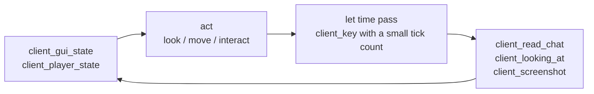

# Debugging workflows

MCMCP's client tools were built for a specific job: driving a Minecraft client from outside it and
being able to tell what happened. This page covers the workflows they exist to support.

## The observe–act–verify loop

Driving a game client blind does not work. Input is sampled per tick, the world reacts
asynchronously, and an action that "did nothing" has at least three common causes that look
identical from the outside. The loop that does work:



The `verify_visually` prompt encodes exactly this, pre-filled with current state.

## Screenshots

```json
{"name": "client_screenshot", "arguments": {}}
```

```
Screenshot saved to C:\...\.minecraft\screenshots\mcmcp-1753992104233.png
```

plus a `resource_link` to `minecraft://client/screenshot/mcmcp-1753992104233.png`.

**The image is not in the response by default.** An inline frame costs a model something like a
thousand tokens, spent whether or not anything ends up looking at the picture. The default gives you
a path — enough for a developer to open the file — and a link a client can follow on demand.

When the model genuinely needs to see the frame:

```json
{"name": "client_screenshot", "arguments": {"inline": true, "name": "before-place.png"}}
```

**Say how big it should be.** An image is charged by its area, roughly `width × height / 750` tokens,
so without `max_dimension` the price of a screenshot is set by however large the game window happens
to be — the same question costing three times as much on a 1080p client as on a 720p one. It caps the
long edge of the inline copy only; the saved file keeps its full resolution.

```json
{"name": "client_screenshot", "arguments": {"inline": true, "max_dimension": 640}}
```

640 (~550 tokens) is enough to tell which screen is open or roughly where the player is looking; 1280
(~1,230, the default) reads GUI labels and the F3 overlay. 1568 is the ceiling — beyond it the image
is downscaled before the model ever sees it, so the extra pixels are paid for and discarded.

Things worth knowing:

- It captures the **last rendered frame**, so open GUIs, chat and the F3 overlay all appear.
- It runs on the client thread, because reading the framebuffer needs a live OpenGL context.
- It does not force a fresh render. Drawing a frame outside the normal render loop is a good way to
  corrupt GL state.
- Names may not contain path separators or `..`. Omit the name for a timestamped one.

To fetch the bytes later:

```json
{"method": "resources/read",
 "params": {"uri": "minecraft://client/screenshot/mcmcp-1753992104233.png"}}
```

## Running commands from the client

```json
{"name": "client_send_chat", "arguments": {"message": "/time query daytime"}}
```

The reply does **not** come back in the tool result. `sendChatMessage` puts the command on the wire
and returns; the server answers some ticks later as an unsolicited chat packet with nothing tying it
to the request. There is no request/response pairing to hook.

So it is two steps:

```json
{"name": "client_read_chat", "arguments": {"lines": 10}}
```

`client_read_chat` reads a rolling 300-line buffer that MCMCP fills from `ClientChatReceivedEvent`.
It captures command output, other players, death messages and anything mods print to chat.

For a live feed instead of polling, subscribe to `minecraft://client/chat/recent`. It is the one
resource that pushes: every incoming message fires a `notifications/resources/updated` down the SSE
stream.

Compare with the server endpoint, where `server_run_command` *does* return output — there,
`CapturingCommandSender` intercepts the sender's messages synchronously.

## Synthetic input

All of it goes through `KeyBinding.setKeyBindState` and `KeyBinding.onTick`, the same two entry
points the real keyboard handler uses. Consequently synthetic input is subject to every rule a
human's is, including whatever anti-cheat the server runs.

Because Minecraft samples input once per tick, a key pressed and released inside one call is never
observed. So every input tool takes a duration in ticks and a scheduler holds the key down across
real ticks, releasing it when the count runs out. Tools return once that input has been **applied**,
not once the world has settled.

```json
{"name": "client_look",   "arguments": {"lookAtX": 100, "lookAtY": 64, "lookAtZ": -50}}
{"name": "client_move",   "arguments": {"direction": "forward", "ticks": 20, "sprint": true}}
{"name": "client_interact","arguments": {"action": "attack", "ticks": 40}}
```

`client_move` returns the distance actually travelled, which is the number that matters — it is zero
when something was in the way, and that is a fact worth checking rather than assuming.

`client_look` with `lookAtX/Y/Z` computes yaw and pitch from the player's **eye** position, not their
feet. Aiming from the origin points the camera about 1.6 blocks low, which for a nearby target is the
difference between hitting it and hitting the ground.

Holds are released automatically if the player leaves the world mid-hold. Without that, a key stays
latched and the player rejoins already walking forward with no physical key to let go of.

## Diagnosing "nothing happened"

Three causes, three checks:

| Check | Tells you |
| --- | --- |
| `client_gui_state` | Whether a GUI is open and swallowing input, and whether the window has focus |
| `client_looking_at` | Whether the crosshair is actually on the intended target |
| `client_read_chat` | Whether the server rejected the action and said so |

`client_gui_state` also reports `pendingSyntheticKeys` — how many holds are still in flight. Non-zero
when you expected zero means a previous tool has not finished.

## Reading the log

```json
{"name": "game_read_log", "arguments": {"lines": 100, "filter": "MCMCP"}}
```

A crash, a mod's error, a failed command and a mixin that did not apply all end up in
`logs/latest.log` and nowhere a model could otherwise see them.

The reader seeks backwards from the end of the file. `latest.log` on a modded 1.12.2 instance
routinely passes 50 MB during a session, and reading it forwards to keep the last 100 lines would
allocate all of it inside the game process. A filtered read scans further back than an unfiltered one
— up to 200,000 lines — because a filter matching one line in a hundred would otherwise return almost
nothing.

The `diagnose_errors` prompt does the usual first pass for you: recent `ERROR` and `WARN` lines,
already collected.

## Performance

```json
{"name": "client_runtime_info", "arguments": {}}
```

Frame rate, heap usage, render distance and graphics settings — roughly what F3 shows. Frame rate is
how you notice a model asking too much: a screenshot every tick shows up as a frame-rate collapse
long before it shows up as an error.

On the server endpoint, `server_world_info` reports mean tick time and derived TPS. Ticks are 50 ms
apart, so anything above 50 ms per tick means the server is behind and every scheduled MCP task is
waiting on it. Check it before running a large scan.

### Finding what a change cost

Measure, change, measure again. `server_tick_stats` gives the tick's distribution rather than a
mean, and `client_frame_stats` with `sample_seconds` measures a fresh window of frames — compare its
`renderWork`, not `fps`, because under a frame cap FPS does not move until the cap is breached.
`game_health` with `sample_seconds` adds the game thread's allocation rate, which is how
garbage-heavy code shows up before it becomes a GC pause.

### Finding the block to blame

| Symptom | Tool | Names |
| --- | --- | --- |
| Slow tick | `server_profile_ticking` | the tile entity or entity, with its position |
| Slow tick, nothing individually expensive | `server_census` | what there is too much of, and in which chunk |
| Slow tick, no tile entity to blame | `server_profile_sections` | the phase — scheduled ticks, random ticks, spawning |
| Slow frame | `client_profile_rendering` | the block (TESR) or entity whose renderer is expensive, with its position |
| Slow frame, no TESR to blame | `client_profile_sections` | the phase — `terrain`, `updatechunks`, `entities` |
| Any of the above, and now *why* | `game_cpu_sample` | the method, and the mod package it belongs to |
| Hitches at intervals | `server_tick_stats` / `client_frame_stats` → `ofThoseDuringGc`, then `game_health` | whether it is garbage collection |
| An occasional hitch that is *not* GC | `game_cpu_sample` with `only_over_ms` | the method, from the slow ticks alone |

In singleplayer the tick tools are on the **server** endpoint and the frame tools on the **client**
endpoint; one game serves both. See the [tool reference](../reference/tools.md#performance) for what
each can and cannot see.

## Development launches

`addon.gradle` starts both endpoints automatically in `runClient` and `runServer`:

| Task | Client endpoint | Server endpoint |
| --- | --- | --- |
| `runClient` | 25585 | 25586 |
| `runServer` | 25587 | 25588 |

`-Dmcmcp.dev.port` is a **base**: the client endpoint takes it and the server endpoint takes base+1.
That matters because a `runClient` that opens a singleplayer world is running both endpoints in one
JVM. Override with `./gradlew runClient -PmcpBasePort=26000`.

These are defaults only — anything set in the generated `config/mcmcp.cfg` wins, so editing the config
is never a fight with the build script.
