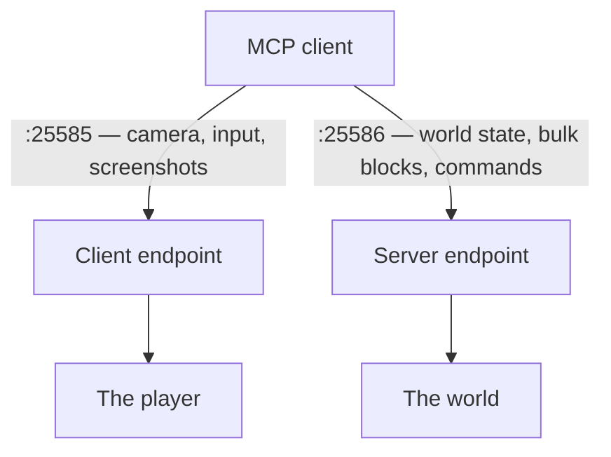

# Client vs server endpoint

MCMCP runs two independent MCP servers. They share one protocol implementation and one tool registry
and differ in exactly two ways: which tools they expose, and which thread they marshal work onto.

Understanding which one you want is the single most important decision when setting MCMCP up.

## At a glance

| | Client endpoint | Server endpoint |
| --- | --- | --- |
| Runs in | Player's game client | Dedicated or integrated server |
| Default port | 25585 | 25586 |
| Enabled by default | Yes | No |
| Requires server-side install | No | Yes |
| Requires operator rights | No | Yes, implicitly |
| Works on someone else's server | **Yes** | No |
| World visibility | Loaded chunks within render distance | Every loaded chunk in every dimension |
| Player visibility | The one player, plus the tab list | Every connected player, fully |
| Command authority | The player's own permission level | Server console, or as a named player |
| Screenshots | Yes | No |
| Synthetic input | Yes | No |
| Direct block writes | No | Yes, if enabled |
| Chat capture | Yes, subscribable | No |

## The client endpoint

Runs inside a player's own process and acts as that player.

Its defining property is that it **needs nothing from the server**. Drop the jar in your own `mods/`
folder, join any server you can normally join, and a model can drive your character there. No plugin
on the far side, no operator rank, no port forwarding, no cooperation from whoever runs it.

That works because everything the client endpoint does goes through the same paths a human's input
does:

- Movement, interaction and camera go through `KeyBinding` state, exactly as the keyboard handler
  sets it.
- Commands and chat go through `sendChatMessage`, byte-for-byte what pressing ++t++ produces.
- Block and entity reads come from the client's own world copy — no different from what is on screen.

So the endpoint inherits every limit the player has. Reach distance applies. Block-break progress
applies. Item cooldowns apply. Server-side movement validation applies. A model cannot mine through
bedrock, teleport, or run `/gamemode` unless the player themselves could.

**What it cannot see.** A Minecraft client does not have the world — it has the chunks the server has
streamed to it and the entities within tracking range. `client_get_block` outside that reports
`loaded: false`, which means *unknown*, not *empty*. Any tool that would need authoritative state
simply is not offered here.

## The server endpoint

Runs inside the dedicated server, or the integrated server behind a singleplayer world.

It sees the authoritative world: every loaded chunk in every dimension, every player's exact state,
and it can write blocks directly and run commands with console authority. It is the right choice for
world inspection, bulk building, and administration.

It is **off by default** because it is a much larger grant than the client endpoint. Enabling it hands
whoever holds the token authority over everyone's world, not just over one character. That should be
a deliberate decision by whoever operates the server.

**What it cannot do.** There is no camera and no input. No screenshots, no keystrokes, no "what is on
my screen". A dedicated server has no display and never renders a frame.

**Direct writes bypass hooks.** `server_set_block` and `server_set_blocks` write straight into the
world. They do not fire block-place events, so claim protection, machinery callbacks and every other
mod's hooks do not run. That is why they sit behind `permissions.allowWorldEdits`, off by default. On
a world with protection mods, prefer commands or player actions.

## Running both

They are not alternatives. A singleplayer world with both endpoints enabled is the most capable
configuration MCMCP offers: authoritative world queries and bulk building on one port, a camera and
player control on the other.

In a development launch this is automatic: `addon.gradle` passes `-Dmcmcp.dev.autostart=true` to both
`runClient` and `runServer`, with non-overlapping port bases so four endpoints across two JVMs never
collide.

## Choosing

- **Playing on someone else's server, or you do not run one** → client endpoint. It is the only
  option, and it is the default.
- **Building, world inspection, administration on your own server** → server endpoint. Enable it
  explicitly.
- **Developing against MCMCP, or working in singleplayer** → both.
- **Anything involving looking at the screen** → client endpoint. There is no other way to get a
  frame.

## How the split is enforced

Every tool, resource and prompt declares the sides it supports. The registry filters on that in two
places: the listing (`tools/list` never mentions a tool the endpoint cannot run) and the call path (a
call to a tool not available on this side returns "no tool named X is available on the *side*
endpoint").

Filtering the listing matters more than it looks. Tool discovery is how a model plans, and a tool
that is listed but permanently broken is worse than one that was never listed — it produces a plan
that cannot work and a failure the model cannot diagnose.

The CI smoke test asserts both directions: that `server_get_blocks` appears on the server endpoint,
and that `client_screenshot` does not.
