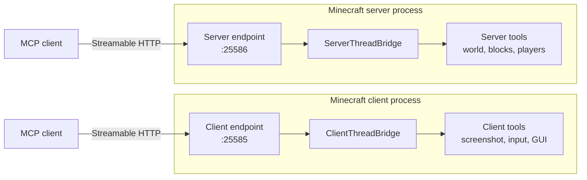

# MCMCP — Minecraft Model Context Protocol

MCMCP embeds a [Model Context Protocol](https://modelcontextprotocol.io) server inside **Minecraft
1.12.2 Forge**. A running game — a player's client, a dedicated server, or both at once — becomes an
MCP endpoint that any MCP client can connect to, inspect and act on.

It ships as an ordinary mod jar with no third-party runtime dependencies. JSON goes through the Gson
that Minecraft already bundles; the transport is the JDK's own `com.sun.net.httpserver`.

<div class="grid cards" markdown>

-   :material-monitor: **Client endpoint**

    ---

    Runs inside a player's game client and acts as that player. Works on **any server they can
    join** — no server-side install, no operator rights, no inbound port. Includes screenshots,
    synthetic input and GUI inspection.

    [:octicons-arrow-right-24: Endpoint comparison](guide/endpoints.md)

-   :material-server: **Server endpoint**

    ---

    Runs inside a dedicated or integrated server. Authoritative world state across every loaded
    dimension, bulk block read and write, commands with server authority. Off by default.

    [:octicons-arrow-right-24: Configuration](reference/configuration.md)

</div>

!!! warning "Status: early. No public build yet."

    MCMCP is not on CurseForge or Modrinth. It builds, loads on both sides, and serves a full MCP
    handshake in CI, but it has not been through a public test. Expect the tool surface to change.

## Why a client endpoint matters

The obvious way to expose Minecraft over a protocol is to put the server in the dedicated server.
That works, and MCMCP supports it — but it only helps people who operate their own server.

The client endpoint has no such requirement. It runs in the player's own process and drives that one
player through the same input path a keyboard uses. Consequently it works unchanged on a friend's
server, a public server, or a realm, and it cannot do anything the player could not do by hand:
reach distance, permission level, inventory contents and server-side movement checks all apply
exactly as they do to a human.

That containment is a design constraint, not an accident. See [Security model](guide/security.md).

## What it exposes

| MCP feature | Support |
| --- | --- |
| Tools | 33 built in — world queries, bulk block read/write, player control, commands, screenshots, input, diagnostics |
| Resources | 7, including a subscribable chat feed and a screenshot template |
| Prompts | 4 workflow starters, expanded with live game state |
| Logging | `logging/setLevel` with per-session verbosity |
| Completions | Resource URI completion |
| Progress & cancellation | Progress notifications and cooperative cancellation |
| Transport | Streamable HTTP (POST + SSE), bearer auth, session management |
| Protocol versions | `2024-11-05`, `2025-03-26`, `2025-06-18` |

Full lists: [Tools](reference/tools.md) · [Resources](reference/resources.md) ·
[Prompts](reference/prompts.md) · [Protocol support](reference/protocol.md)

## Thirty seconds to a connection

```bash
# 1. Drop the jar in mods/, start the game, then in-game:
/mcmcp status      # confirms the endpoint is listening
/mcmcp token       # click to copy the generated bearer token

# 2. From a shell on the same machine:
curl -s http://127.0.0.1:25585/mcp/health

curl -s -X POST http://127.0.0.1:25585/mcp \
  -H "Authorization: Bearer $MCMCP_TOKEN" \
  -H 'Content-Type: application/json' \
  -d '{"jsonrpc":"2.0","id":1,"method":"initialize",
       "params":{"protocolVersion":"2025-06-18","capabilities":{},
                 "clientInfo":{"name":"curl","version":"1.0"}}}'
```

The full walkthrough, including wiring it into an MCP client's config, is in
[Connecting a client](guide/connecting.md).

## Architecture in one diagram



Both endpoints share one tool registry and one protocol implementation; they differ only in which
tools they expose and which thread they marshal onto. The details, including the threading rules that
make this safe, are in [Architecture](dev/architecture.md).

## Conventions used throughout

- **Block positions are integers; entity positions are not.** A player at `y=64.0` is standing *on*
  the block at `y=63`. Tools report both where the distinction matters.
- **Y is vertical**, and the 1.12.2 world runs from `y=0` to `y=255`.
- **Yaw** is degrees clockwise from south (`0` = +Z, `90` = -X, `180` = -Z, `270` = +X). **Pitch** is
  degrees down from horizontal, in `[-90, 90]`.
- **Registry ids are namespaced.** `minecraft:stone`, never `Stone`. Display names are localised;
  ids are what tools and commands accept.
- **Actions take game time.** Input tools apply input for a number of ticks (20 ticks = 1 second) and
  return once that input has been *applied*, not once the world has finished reacting to it.

## Contributing to this wiki

Every page here is Markdown under
[`docs/`](https://github.com/Mica-Technologies/MCMCP/tree/main/docs) in the mod's own repository, so a
documentation fix is an ordinary pull request. Pushing to `main` rebuilds and republishes the site.
Use the :material-pencil: edit icon at the top of any page to jump straight to its source.
